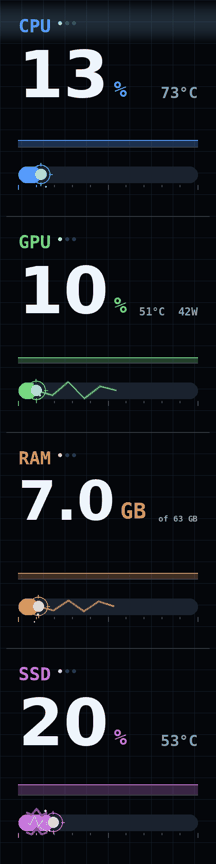
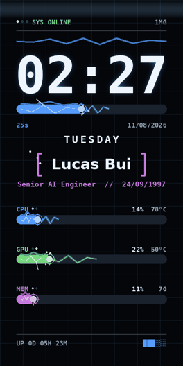
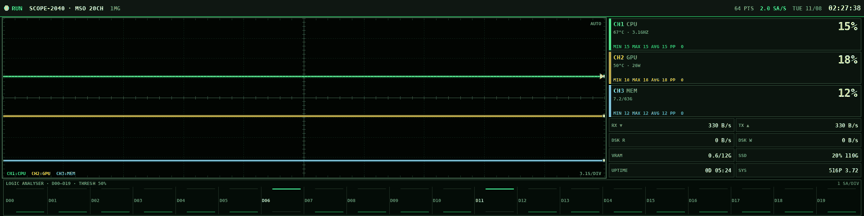
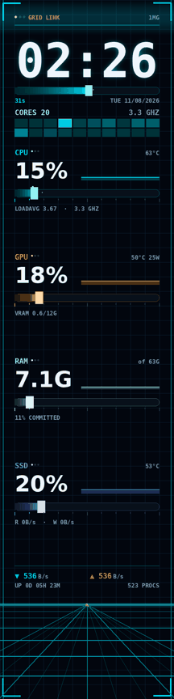
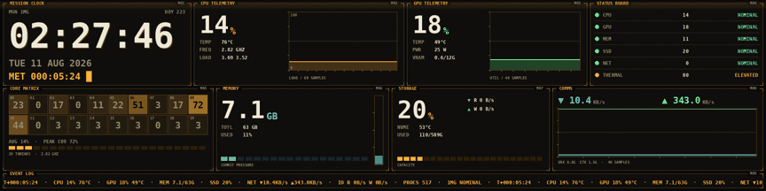
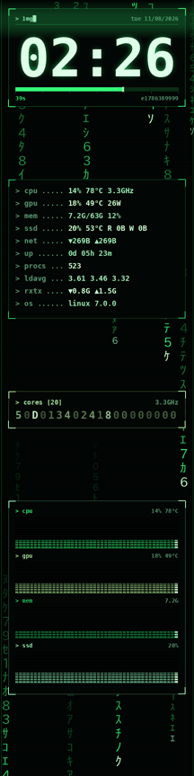
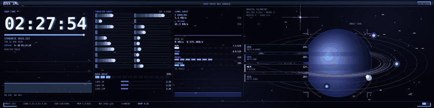
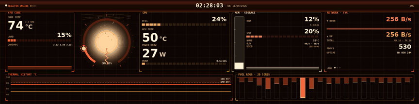
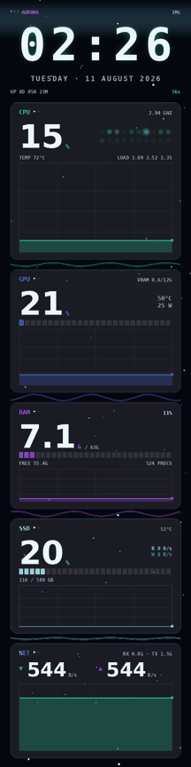
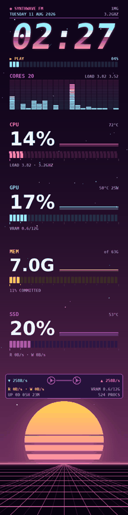

# pc-screens — dashboard động cho màn hình phụ trong case + đồng bộ LED

> Linux daemon driving the Lian Li 8.8" Universal Screen and the Jungle Leopard /
> HONGTAI in-case panel with 12 animated themes, palette/animation customization,
> and theme-synced ARGB (bezel ring + whole-case via OpenRGB). Docs in Vietnamese.

Điều khiển màn **Lian Li 8.8" Universal Screen** và màn **Jungle Leopard / HONGTAI**
trên Linux thay cho phần mềm Windows (L-Connect 3 / app vendor), kèm **12 theme
hoạt ảnh**, hệ **palette/anim tuỳ biến**, và **đồng bộ LED** — vòng ARGB quanh màn
lẫn toàn bộ đèn case qua OpenRGB. Tất cả cấu hình nằm trong một file
[`config.toml`](config.example.toml).

**Trạng thái: đang chạy**, tự khởi động cùng máy.

## Gallery

Mỗi theme được quay 3 giây thực ở đúng fps đang chạy. Nhóm **dọc** (canvas
480×1920 và 480×960 — cách lắp hiện tại), nhóm **ngang** (1920×480 và 960×480 —
khi xoay panel về ngang). Theme nào cũng render được mọi cỡ; nhóm chỉ là hướng
được tối ưu nhất.

| Theme dọc | | Theme ngang | |
|---|---|---|---|
| `system-electric` |  | `carbon-gauge` |  |
| `clock-electric` |  | `oscilloscope` |  |
| `neon-grid` |  | `mission-control` |  |
| `matrix` |  | `deep-space` |  |
| `holo-ring` |  | `plasma-core` |  |
| `aurora` |  | | |
| `synthwave` |  | | |

Bản còn lại của từng theme (cỡ kia) nằm trong [`captures/`](captures/).

| Theme | Chất liệu |
|---|---|
| `system-electric` / `clock-electric` | Hồ quang điện phóng dọc thanh đo, điện cực đập nhịp, tia lửa theo tải |
| `neon-grid` | Tron: sàn lưới phối cảnh cuộn theo tải CPU, light-cycle, thanh đo vệt sáng, lưới nhiệt 20 lõi |
| `matrix` | Mưa glyph katakana 2 lớp, log terminal có hiệu ứng giải mã, lõi CPU dạng hex, CRT |
| `holo-ring` | JARVIS: cụm vòng cung đồng tâm, radar quét có blip + danh sách mục tiêu, glitch hologram |
| `aurora` | Cực quang trôi (đổi màu theo nhiệt CPU), thẻ kính mờ dày thông tin, sao lấp lánh |
| `synthwave` | Mặt trời sọc retro, đồng hồ chrome 2 tông, VU-meter có peak-hold, sàn lưới tím |
| `carbon-gauge` | Đồng hồ kim vật lý lò xo giảm chấn, shift-light F1, LCD ghost, vân carbon |
| `oscilloscope` | 3 kênh sóng cuộn liên tục có lưu ảnh phosphor, trigger, logic-analyzer 20 lõi |
| `mission-control` | Tường telemetry 9 module kiểu NASA, bảng đèn trạng thái NOMINAL/CRITICAL, ticker |
| `deep-space` | Trường sao warp theo tải, hành tinh có vành + mặt trăng, quỹ đạo = đồng hồ đo, sao chổi khi spike |
| `plasma-core` | Lõi plasma đổi màu theo nhiệt (cam → trắng), tàn lửa theo công suất GPU, thanh nhiên liệu 20 lõi |

## Phần cứng

| Thiết bị | USB ID | Kết nối | Framebuffer |
|---|---|---|---|
| Lian Li 8.8" Universal Screen | `1cbe:a088` | bulk vendor-specific, EP `0x01`/`0x81` | 480×1920 |
| Vòng ARGB quanh màn Lian Li (60 LED) | `0416:8050` | bulk vendor-specific (WCH MCU) | — |
| Jungle Leopard / HONGTAI | `33c3:7788` | USB-CDC → `/dev/ttyACM0` @ 2 Mbaud | 960×480 |
| Đèn case (quạt, GPU…) | — | OpenRGB SDK server | — |

Cả hai là thiết bị vendor-specific, kernel không có driver — điều khiển từ
userspace bằng đúng giao thức riêng (xem mục [Giao thức](#giao-thức)).

## Cài đặt

```bash
sudo bash setup-root.sh                       # udev rules + gói build + evdi
python3 -m venv .venv
.venv/bin/pip install pillow psutil pyusb pycryptodome pyserial openrgb-python
cp config.example.toml config.toml            # rồi chỉnh theo ý
cp systemd/pc-screens.service ~/.config/systemd/user/   # sửa đường dẫn nếu khác
systemctl --user daemon-reload
systemctl --user enable --now pc-screens.service
loginctl enable-linger "$USER"                # sáng màn từ lúc boot, chưa cần đăng nhập
```

Muốn đồng bộ cả đèn case:

```bash
cp systemd/openrgb-server.service ~/.config/systemd/user/
systemctl --user enable --now openrgb-server.service
# rồi bật [case_led] enabled = true trong config.toml
```

## Cấu hình — `config.toml`

Mọi thiết lập nằm trong một file TOML (tìm theo thứ tự: `--config FILE` →
`~/.config/pc-screens/config.toml` → `config.toml` cạnh daemon). Cờ CLI cùng tên
luôn thắng file. Tham khảo đầy đủ: [`config.example.toml`](config.example.toml).

```toml
[global]
anim = "normal"          # calm | normal | intense — độ "bận" của hoạt ảnh
palette = ""             # ép bảng màu mọi theme; "" = màu đặc trưng từng theme

[lianli]
view = "system-electric" # theme cho từng màn
rotate = 0               # 0 | 90 | 180 | 270 (ngược kim đồng hồ)
fps = 19.0

[led]
style = "sweep"          # vòng LED quanh màn — xem mục LED

[case_led]
enabled = false          # bật nếu muốn quạt + GPU thở theo palette của theme
```

Đổi cấu hình → `systemctl --user restart pc-screens` — không cần đụng unit file.

### Bảng màu — `palette`

`spectrum` (mặc định cũ) · `cyan` · `ember` · `violet` · `lime` · `ice` · `mono`,
hoặc tự đưa 4 mã hex: `custom:#00e5ff,#ff9d2e,#ffd34f,#b44fff`. Đặt chung
(`[global]`) hoặc riêng từng màn (`[lianli] palette=...`). Mọi theme — kể cả màu
sét, nền lưới, mưa glyph, mặt trời — đều đọc màu qua palette nên đổi một dòng là
đổi toàn bộ.

### Hai đồng hồ tách rời — fps và `readout_hz`

fps mua **độ mượt chuyển động**; `readout_hz` (mặc định 2) quyết định **tần suất
chữ số được đổi**. Số liệu lấy mẫu 2 lần/giây rồi giữ nguyên — chữ không nháy, và
mẫu 500 ms chính xác hơn hẳn đọc cảm biến 19 lần/giây. Thanh đo thì *trượt* tới
giá trị mới trong ~0.3 s (`FXBase.ease`) thay vì giật theo nhịp mẫu. Cả hai màn
dùng chung một mẫu (`fx.vitals()`) nên luôn hiện cùng con số.

Trần fps thực đo (gồm truyền USB): Lian Li 22.6, Leopard 20.0 — cấu hình 19/17
để một khung chậm không dồn hàng đợi.

### Nhịp hoạt ảnh — `anim`

Mọi thành phần chuyển động chạy theo **đồng hồ thực**, không theo bộ đếm khung:
tăng fps làm mượt hơn chứ không nhanh hơn. Mỗi thành phần có nhịp riêng (hằng số
`HZ_*` đầu mỗi theme); `anim = calm/normal/intense` nhân toàn bộ nhịp và mật độ
hạt ×0.5/×1/×1.6. Hiệu ứng ngẫu nhiên (tia sét, glitch, blip radar) đóng băng
theo *cửa sổ RNG* (`FXBase.wrng`): cùng cửa sổ → cùng hình, nên sét giữ nguyên
dáng vài khung rồi mới đổi — đó mới là dáng của sét, không phải nhiễu tĩnh.

## LED

### Vòng ARGB quanh màn Lian Li — `[led]`

Driver riêng ([`argb.py`](argb.py), protocol 3 gói bulk 64 byte). Vòng đèn là
"khung tranh" của màn Lian Li nên nó bám theo theme đang chạy bên trong:

- `style = "sweep"` — vòng tối, chỉ các LED ngang tầm **vệt quét trên màn** sáng
  lên rồi phai nhanh phía sau (mặc định).
- `style = "aurora"` — gradient palette thở chậm quanh vòng + spark theo tải CPU.

Phần cứng không khai báo LED số 0 nằm góc nào, nên có 3 khoá hiệu chỉnh:
`layout` (`ring` = một chuỗi vòng quanh chu vi / `mirror` = hai nhánh đối xứng
chạy dọc hai mép), `offset` (xoay điểm gốc) và `reverse` (đảo chiều). Cách cân:

```bash
systemctl --user stop pc-screens
.venv/bin/python argb.py --calibrate    # 6 khối màu tĩnh 60 giây: đỏ lá dương vàng tím cyan
systemctl --user start pc-screens
```

Nhìn vị trí các khối màu trên khung → chỉnh 3 khoá cho khớp.

### Đèn case — `[case_led]`

[`case_led.py`](case_led.py) nói chuyện với **OpenRGB SDK server** (unit
[`systemd/openrgb-server.service`](systemd/openrgb-server.service)): quạt case /
dải ARGB thở gradient palette của theme + spark theo tải CPU; thiết bị một vùng
(GPU) nằm ở màu accent chính và **ấm dần về trắng theo nhiệt độ GPU**. Cùng chịu
`anim`. Thiếu openrgb-python hay server chưa chạy thì daemon chỉ log rồi bỏ qua —
màn hình không bao giờ bị vạ lây. Lưu ý: GPU điều khiển qua i2c (RGB Fusion) nổi
tiếng chập chờn — có lần dò ra, lần không; worker tự nhận lại khi nó xuất hiện.

## Kiến trúc & viết theme mới

```
fx.py               palette, hệ số anim, telemetry chung (vitals/hold/hist),
                    FXBase: đồng hồ hoạt ảnh + widget (bolt, arc, ribbon, glow…)
themes/<tên>.py     mỗi theme một file, tự đăng ký qua dict VIEWS
panel_daemon.py     worker từng panel + LED + config TOML + CLI
preview_render.py   render offline: PNG / GIF ở mọi kích thước, không cần phần cứng
argb.py, case_led.py, lianli88.py, jungle.py    driver từng thiết bị
```

Theme mới = một file trong `themes/` với class có `render() -> PIL.Image` và
`VIEWS = {"tên": Class}` ở cuối — tự xuất hiện trong `--view-*` và config. Quy
ước chất lượng (xem [`themes/neon_grid.py`](themes/neon_grid.py) làm mẫu):

- Mọi chuyển động theo `self.t`/`hz()`/`wrng()` — cấm animate theo bộ đếm khung.
- Số liệu chỉ đọc từ `fx.vitals()` (đã giữ trên sample clock); lịch sử qua
  `self.hist()` — một điểm mỗi mẫu, không phải mỗi khung.
- Lớp tĩnh (nền, khung, mặt đồng hồ) dựng **một lần** trong `__init__`; không
  GaussianBlur cả canvas mỗi khung (glow đồng hồ thì cache theo phút).
- Nhận `palette=None` → dùng palette đặc trưng riêng; có palette → tôn trọng nó
  cho *mọi* pixel.

Test nhanh:

```bash
.venv/bin/python preview_render.py --view matrix --size 480x1920 --png /tmp/x.png
.venv/bin/python preview_render.py --view matrix --size 480x960 --seconds 3 \
    --fps 17 --scale 0.5 --gif /tmp/x.gif --palette ember
```

## Hiệu năng

Thời gian vẽ trung bình mỗi khung (đo 60 khung trên máy này, canvas lớn nhất của
nhóm):

| Theme | ms | Theme | ms |
|---|---|---|---|
| carbon-gauge | 3.1 | mission-control | 13.1 |
| deep-space | 9.6 | clock-electric | 13.9 |
| plasma-core | 9.6 | matrix | 14.4 |
| holo-ring | 10.4 | aurora | ~11–16 |
| synthwave | 10.4 | | |
| neon-grid | 10.6 | | |
| system-electric | 11.1 | | |

Nút cổ chai là truyền USB chứ không phải vẽ: đẩy khung 119 KB lên màn Lian Li mất
17.5 ms. Toàn daemon (2 màn 19/17 fps + vòng LED 24 fps + case LED 10 fps) ăn
~3.3% tổng CPU của máy 20 lõi. Kỹ thuật giữ chi phí thấp: lớp tĩnh dựng một lần,
glow cache theo phút, ribbon vẽ cục bộ thay vì composite cả canvas, cảm biến chỉ
đọc 2 lần/giây.

**Python có làm chậm không?** Không đáng kể — phần Python (vẽ + nén) chiếm ~12 ms
trong 29 ms mỗi khung Lian Li; phần còn lại là USB và ack, ngôn ngữ nào cũng mất
từng đó.

## Dùng thủ công

Dừng service trước, nếu không hai bên tranh thiết bị:

```bash
systemctl --user stop pc-screens.service
```

```bash
.venv/bin/python lianli88.py info|image|text|brightness|rotation|clear|desktop
.venv/bin/python jungle.py info|image|text|brightness|restart
.venv/bin/python argb.py                 # smoke test vòng LED
.venv/bin/python argb.py --calibrate     # 6 khối màu để cân layout
.venv/bin/python panel_daemon.py --only jungle --view-jungle matrix --fps-jungle 17
```

> **Vì sao phải stream liên tục:** firmware HONGTAI có timeout live-play — gửi
> một ảnh rồi ngừng thì panel tắt sau vài giây. Giữ nhịp khung hình giữ cả hai
> màn luôn sáng.

## Desktop mode — biến màn Lian Li thành màn hình phụ thật

`lianli88.py desktop` khiến panel enumerate lại thành `1a86:ace1`/`ad21`; khi đó
project [sgtaziz/lian-li-linux](https://github.com/sgtaziz/lian-li-linux) (clone
để trong `lian-li-linux/`, không kèm theo repo này) gắn nó làm output ảo qua
`evdi` — kéo thả cửa sổ vào được như màn hình thật. Quay về chế độ ảnh bằng GUI
của project đó.

## Giao thức

### Lian Li 8.8" — header 512 byte mã hoá DES

```
plaintext[500]:
  [0]     opcode            0x65 push-JPEG, 0x0A get-version, 0x0E brightness,
                            0x0D rotate, 0x33 set-clock, 0x7A query-buffer,
                            0x79 start-play (H.264), 0x96 switch-to-desktop
  [2..4]  0x1A 0x6D         magic
  [4..8]  timestamp LE u32  ms từ lúc mở phiên, phải tăng nghiêm ngặt
  [8..]   tham số           (JPEG: kích thước payload, BE u32)
ciphertext = DES-CBC(key = iv = "slv3tuzx", PKCS7)  -> 504 byte
header[512] = ciphertext ‖ zeros ‖ 0xA1 0x1A        (trailer ở offset 510)
```

Gửi `header ‖ JPEG` tới EP `0x01`, đọc ack ở EP `0x81` (**không** mã hoá).
Ack: byte 0 lặp lại opcode, byte 1 là status (`0xc8` = 200 OK), byte 8 là độ sâu
buffer thiết bị — lớn hơn 3 thì phải chờ bằng lệnh `0x7A`. Header DES đã kiểm
chứng **trùng từng byte** với mã Rust của lian-li-linux.

### Vòng ARGB `0416:8050` — 60 LED, gói 64 byte

```
byte[0]    = 0x11        set-LED-chunk
byte[1]    = offset      0, 20, 40
byte[4:64] = 20 × RGB
```

Ba gói vẽ trọn vòng; firmware chốt màu ngay khi nhận — "direct mode" chỉ là
stream khung liên tục.

### Jungle Leopard — hai kênh trên cùng một cổng serial

```
Kênh lệnh:  [0x55 0xAA][len u16 LE][key][payload][checksum u16 LE]
            len = len(payload) + 7 ;  checksum = tổng mọi byte trước đó & 0xFFFF
            Phản hồi cùng khung; bytes[5:-2] là JSON UTF-8.
            0x01 restart · 0x03 brightness · 0x06 getInfo · 0x11 commit · 0x21 close
Kênh ảnh:   sau lệnh 0x11 một lần, ghi thẳng JPEG.
            Firmware có version ép kiểu số > 2.8 (máy này: 3.1) thì bọc thêm
            [len u32 LE][jpeg][checksum u16 LE].
```

Ba điểm dễ vấp:

- Link 2 Mbaud cần **DTR bật**, nếu không thiết bị nhận ghi nhưng không hồi đáp.
- Phải đọc phản hồi bằng **một lệnh `read()` duy nhất** — đọc header rồi đọc tiếp
  theo độ dài khai báo sẽ mất byte.
- Lệnh không đọc phản hồi vẫn được ACK — phải xả buffer kẻo ACK bị hiểu nhầm là
  phản hồi của lệnh kế tiếp.

Màn Leopard tự khai model `TXW818-ST7701S-5.5inch-hor`; driver đọc kích thước
trực tiếp từ thiết bị (lệnh `0x06`).

## Kiểm chứng đã chạy

- Header DES của `lianli88.py` khớp từng byte với mã Rust gốc (5 loại lệnh).
- Khung lệnh, checksum, quy tắc ép kiểu version của `jungle.py` — test offline pass.
- Vòng lặp kín đổi độ sáng Jungle Leopard: đặt 30/100/80 → thiết bị báo lại đúng cả ba.
- Vòng ARGB: quét chấm trắng + 6 khối màu hiển thị đúng trên phần cứng thật.
- 12 theme render sạch ở cả hai cỡ canvas của nhóm, palette override kiểm ở mọi theme.
- Daemon chạy liên tục 19/17 fps: **0 lỗi khung** qua nhiều nghìn khung.

## Nguồn

- [sgtaziz/lian-li-linux](https://github.com/sgtaziz/lian-li-linux) — giao thức Lian Li LCD + LED ring (Rust)
- [newan0805/loving_cool_aio_display_manage](https://github.com/newan0805/loving_cool_aio_display_manage) — giao thức HONGTAI `33c3:7788`
- [OpenRGB](https://openrgb.org) — điều khiển đèn case
- [DisplayLink/evdi](https://github.com/DisplayLink/evdi) — màn hình ảo cho desktop mode

Ba thư mục `infopanel/`, `jungleleopard/`, `lian-li-linux/` trong working tree là
clone tham khảo của các project trên (repo riêng, license riêng) — nằm trong
`.gitignore`, không thuộc repo này.
